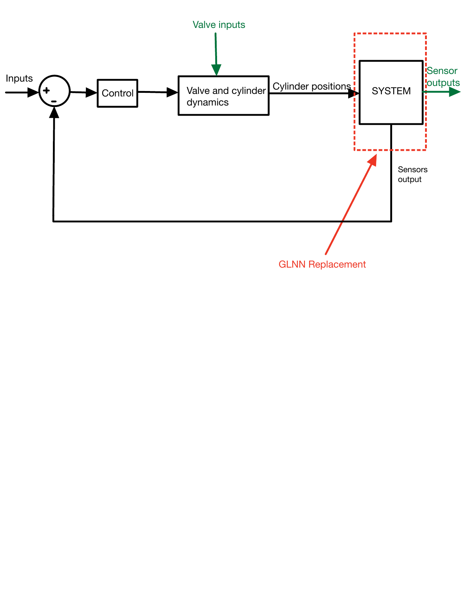

# GLNN — A Lagrangian Neural Network for Machine Dynamics

A **physics-informed neural network** — a *General Lagrangian Neural Network (GLNN)*,
implemented from scratch in **JAX** — that learns the dynamics of an agricultural
**boom-sprayer suspension** directly from sensor data, as a **data-driven replacement
for a hand-derived physics model**.

> **MSc project** — Electro-Mechanical System Design, Aalborg University (EMSD, 3rd
> semester, 2024–25). **Joint work with Bjartur Ragnarsson á Norði** (equal
> collaboration, no split of tasks).
>
> **Industry collaboration / NDA:** this project was carried out with an industrial
> partner. **This repository contains only our own method and implementation.** The
> partner's proprietary data, physical parameters, and their own analytical model are
> deliberately excluded, and system states are described generically.

## The idea

Deriving a dynamic model of a machine by hand (Lagrangian mechanics + system
identification) is slow and must be redone for every new machine variant. The GLNN
learns that model instead:



The trained network **replaces the physics-based system model** in the loop —
mapping inputs and states to the resulting accelerations.

## How the GLNN works

The GLNN combines **two neural networks** with classical mechanics:

1. A network that learns the system's **Lagrangian** (the conservative energy terms).
2. A second network that learns the **non-conservative forces** (damping / friction /
   dissipation) — the part a pure Lagrangian model can't capture.

These are fed through the **Euler–Lagrange equation** (`equation_of_motion` in the
code) to predict the system's accelerations. Training minimises the **mean-squared
error** between predicted and measured accelerations, via gradient-based optimisation.

- **Framework:** JAX (`jax.experimental.stax` for the networks, `jax.grad`/`jax.vmap`
  for the physics and batching, `odeint` for integration).
- **Data pipeline:** sensor signals → generalised positions/velocities (central-
  difference differentiation) → accelerations used as the training target.
- **Tested across** sine, square, and pseudo-random excitation signals, and for one,
  two, and three suspension states.

## Results (summary)

The GLNN successfully learns the suspension's acceleration dynamics, capturing **both
conservative and non-conservative effects**, with **low prediction error**
(mean-squared error on the order of `1e-3` on held-out signals). The study also maps
out the sensitivity to network architecture, learning rate, batch size, and data
normalisation.

Full quantitative results and figures are in the project report (not included here —
see the NDA note above).

## Tech

Python · **JAX** (stax, grad, vmap, odeint) · NumPy · Matplotlib · tqdm.

## Repository layout

```
glnn-machine-model/
├── README.md
├── code/
│   ├── glnn.py       the GLNN implementation (~1370 lines, JAX)
│   └── README.md     how this file was recovered, and its known caveats
└── figures/
    └── glnn_concept.pdf   the "GLNN replaces the physics model" concept
```
